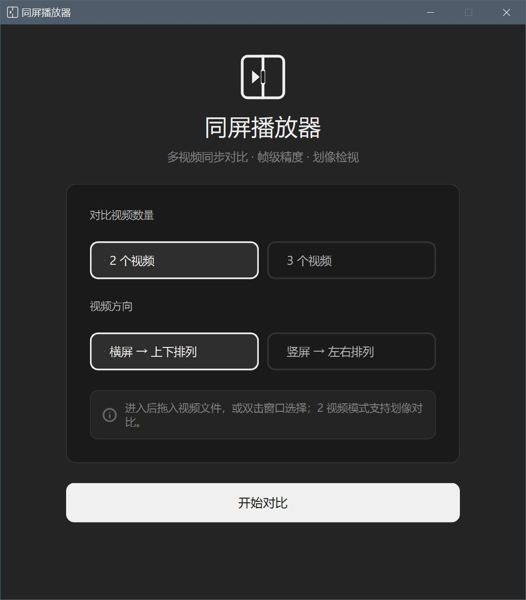
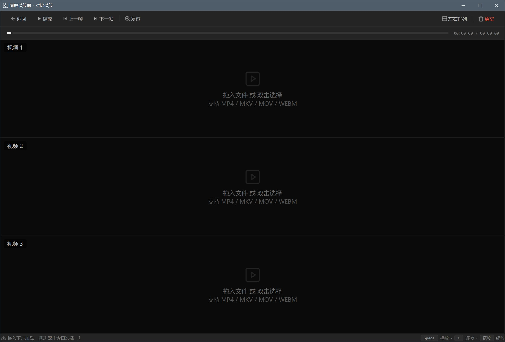
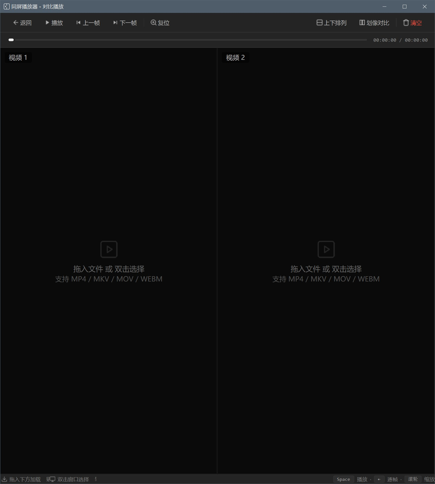

# 同屏播放器

一个 Windows 桌面程序，用于 2~3 个视频的同屏对比播放。纯本地运行，不联网、不处理音频。

## 功能

- 参考设计稿重做的深色界面：启动页（logo + 配置卡片 + 药丸选择）、扁平工具栏、极简进度条、底部快捷键状态栏
- 开始界面选择对比视频数量（2 或 3 个）和视频方向（横屏 / 竖屏）
- 2 个视频：横屏默认上下并列，竖屏默认左右并列，可一键切换布局
- 3 个视频：同样支持上下并列 / 左右并列一键切换
- 把视频文件直接拖进任意窗口即可加载（也支持双击窗口选择文件）
- 所有视频共享一条进度条，拖动时同步跳转
- 支持逐帧前进 / 后退（按钮或键盘 ← →）
- 播放 / 暂停同步进行
- 2 个视频时可切换为「划像对比」：拖动白色分隔线左右（或上下）对比两侧画面
- 2~3 个视频并列时，滚动鼠标滚轮可同步缩放所有窗口，且缩放区域保持一致（都聚焦同一画面区域）；按住左键拖动可平移，双击画面复位缩放
- 每个窗口左上角显示文件名和当前帧号，便于核对帧同步

## 界面截图







## 直接使用（已打包）

运行 `dist\同屏播放器.exe`（约 99 MB，首次启动稍慢属正常）。无需安装 Python 或任何依赖。

## 从源码运行

需要 Python 3.10+：

```bash
pip install -r requirements.txt
python main.py
```

## 重新打包 exe

```bash
build.bat
```

打包结果位于 `dist\同屏播放器.exe`。

## 更换图标

- 应用图标（窗口 / 任务栏 / exe）：主 logo 已内嵌，改动后运行 `python tools\make_app_icon.py` 重新生成 `assets\icon.png`、`icon.ico` 和内嵌模块；exe 图标由 `icon.ico` 提供
- 工具栏小图标：集中在 `player\icons.py` 的 `_ICONS` 字典里，都是内嵌 SVG，改字符串即可

## 操作说明

| 操作 | 效果 |
| --- | --- |
| 拖入视频 / 双击窗口 | 加载视频到对应窗格 |
| 空格 | 播放 / 暂停 |
| ← / → | 上一帧 / 下一帧 |
| 拖动进度条 | 所有视频同步跳转 |
| 鼠标滚轮 | 全部窗口同步缩放（聚焦鼠标所在位置，且各窗口显示同一区域；划像模式同样支持） |
| 左键拖动（放大后） | 同步平移所有窗口 |
| 双击画面 | 复位缩放 |
| R | 复位缩放 |
| 布局按钮 | 上下排列 ↔ 左右排列 |
| 划像对比按钮（2 视频） | 切换并排 / 划像，再点「竖划像」可切换竖划像 / 横划像 |
| 返回按钮 / Esc | 关闭播放窗口，返回开始界面 |

## 项目结构

```
main.py                程序入口
player/
  start_screen.py      开始界面（logo、配置卡片、药丸选择）
  player_window.py     主播放窗口（进度、布局、缩放、划像控制）
  video_pane.py        单个视频窗格（拖放、缩放、平移）
  wipe_pane.py         划像对比窗格
  video_reader.py      视频读取引擎（OpenCV，精确取帧）
  logo.py              主 logo 绘制（启动页与图标共用）
  icons.py             内嵌 SVG 图标
  app_icon.py          应用图标（由脚本生成，内嵌 base64）
  style.py             全局深色主题
tools/
  make_test_videos.py  生成带帧号的测试视频
  make_app_icon.py     生成应用图标（PNG / ICO / 内嵌模块）
  selftest.py          自动化自测（离屏截图验证）
```
